# RLAD Developer Guide

## Table of Contents

1. [Acknowledgements](#1-acknowledgements)
2. [Setting Up the Project](#2-setting-up-the-project)
3. [Design](#3-design)
    - 3.1 [Architecture Overview](#31-architecture-overview)
    - 3.2 [Component Descriptions](#32-component-descriptions)
    - 3.3 [Class Diagram](#33-class-diagram)
4. [Implementation](#4-implementation)
    - 4.1 [Add Transaction](#41-add-transaction)
    - 4.2 [Delete Transaction](#42-delete-transaction)
    - 4.3 [Modify Transaction](#43-modify-transaction)
    - 4.4 [List and Filter Transactions](#44-list-and-filter-transactions)
    - 4.5 [Sort Transactions](#45-sort-transactions)
    - 4.6 [Summarize Transactions](#46-summarize-transactions)
    - 4.7 [Budget Management](#47-budget-management)
    - 4.8 [Storage Management (CSV Export/Import & Clear)](#48-storage-management-csv-exportimport--clear)
5. [Product Scope](#5-product-scope)
6. [User Stories](#6-user-stories)
7. [Non-Functional Requirements](#7-non-functional-requirements)
8. [Glossary](#8-glossary)
9. [Instructions for Manual Testing](#9-instructions-for-manual-testing)

---

## 1. Acknowledgements

- Architecture inspired by [AddressBook-Level2](https://github.com/se-edu/addressbook-level2) and [AddressBook-Level3](https://se-education.org/addressbook-level3/).
- Java `Predicate` chaining pattern adapted from the Java 8 Streams documentation.
- CSV storage design pattern adapted from the Storage feature proposal in the RLAD GitHub issue tracker.

---

## 2. Setting Up the Project

**Prerequisites:**
- JDK 17 or above
- IntelliJ IDEA (recommended) or any Java IDE

**Steps:**
1. Clone the repository.
2. Open IntelliJ and select **File > Open**, pointing to the project root.
3. Ensure the project SDK is set to JDK 17+.
4. Mark `src/main/java` as the **Sources Root**.
5. Run `seedu.RLAD.RLAD` as the main class.

**Building the JAR:**
```
./gradlew shadowJar
```
The output JAR is placed in `build/libs/`.

---

## 3. Design

### 3.1 Architecture Overview

RLAD follows the **MVC (Model-View-Controller)** pattern combined with the **Command Design Pattern**.

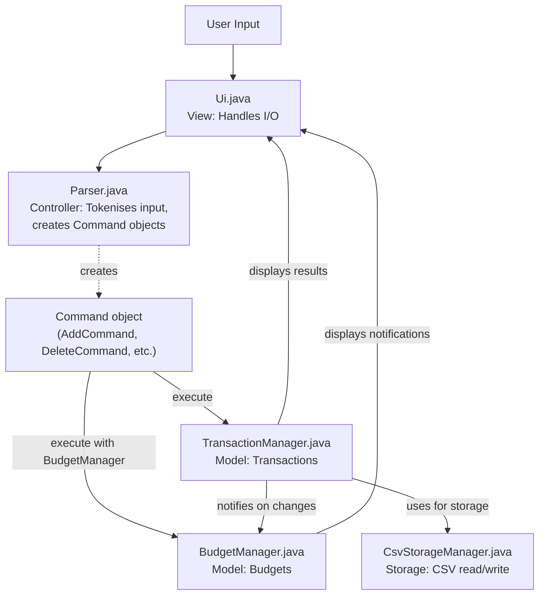

**Main loop in `RLAD.java`:**
1. Read raw input via `Ui.readCommand()`.
2. Parse input via `Parser.parse()` to produce a `Command`.
3. Validate the command via `Command.hasValidArgs()`.
4. Execute the command via `Command.execute()`.
5. Display results via `Ui`.

---

### 3.2 Component Descriptions

#### `RLAD` (Application Controller)

The entry point. Initialises all components, wires them together, and runs the main event loop. Responsible for routing `BudgetCommand` to the overloaded `execute(TransactionManager, Ui, BudgetManager)` method.

#### `Ui` (View)

Handles all input and output. Reads user commands from stdin and provides `showResult()`, `showError()`, `showLine()`, and manual printing methods. Also provides `askConfirmation()` for destructive operations.

#### `Parser` (Controller / Factory)

Tokenises the raw input string into an action and argument string. Acts as a factory, returning a concrete `Command` subclass. Validates that the action is known and that argument-required commands are not invoked bare.

#### `Command` (Abstract Base)

Defines the command contract:
- `execute(TransactionManager, Ui)` — core execution.
- `execute(TransactionManager, Ui, BudgetManager)` — overload for budget-aware commands (defaults to calling the core method).
- `hasValidArgs()` — pre-flight validation.

#### `TransactionManager` (Transaction Model)

The in-memory store for transactions. Maintains a parallel `ArrayList<Transaction>` (preserving insertion order) and `HashMap<String, Transaction>` (O(1) lookup by HashID). Notifies `BudgetManager` on every add, delete, or update.

#### `Transaction`

An immutable-style data record holding type, category, amount, date, description, and a UUID-derived 6-character HashID. HashIDs are guaranteed unique via collision-prevention regeneration.

#### `BudgetManager` (Budget Model)

Stores `MonthlyBudget` objects keyed by `YearMonth`. Listens to transaction lifecycle events from `TransactionManager` to maintain accurate spending totals. Checks budget thresholds after each change and pushes warnings to `Ui`.

#### `MonthlyBudget`

Represents one month's budget: a map of `BudgetCategory -> Double` (allocated amounts) and a `totalIncome` field. Provides disposable income calculation.

#### `BudgetCategory` (Enum)

Defines the 12 fixed spending categories (Food, Transport, ..., Savings), each with a numeric code (1–12) and a display name.

#### `FilterCommand`

A shared utility command. Provides two static methods used by `ListCommand` and `SummarizeCommand`:
- `parseFlags(String)` — splits raw args on `--` boundaries into a key-value map.
- `buildPredicate(String)` — composes a `Predicate<Transaction>` from all active flags.

#### `TransactionSorter`

A stateless utility class. Provides `sort(List, field, direction)` returning a new sorted `ArrayList`. Valid fields: `amount`, `date`. Valid directions: `asc`, `desc`.

#### `CsvStorageManager` (Storage)

Handles all disk I/O. Exports transactions to CSV (with proper escaping) and imports from CSV (with validation, error tracking, and HashID regeneration). Returns an `ImportResult` value object containing success and failure counts.

---

### 3.3 Class Diagram

The following ASCII UML class diagrams capture the key relationships.

#### Core Architecture

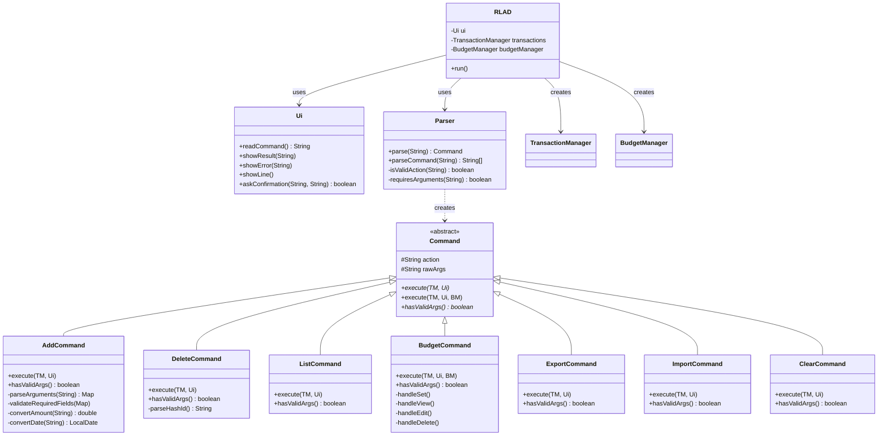

#### Transaction Model

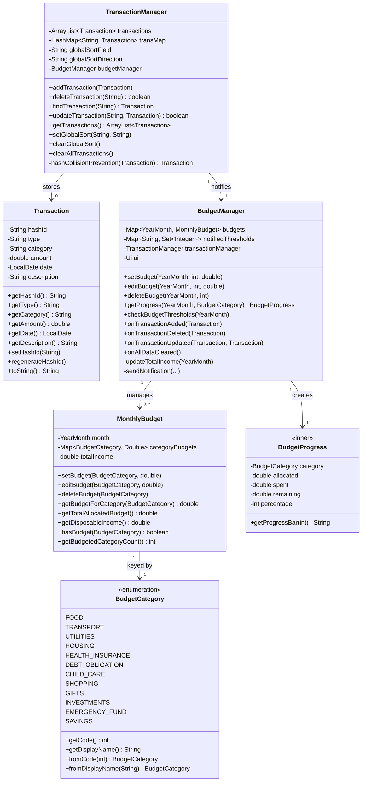

#### Command Hierarchy

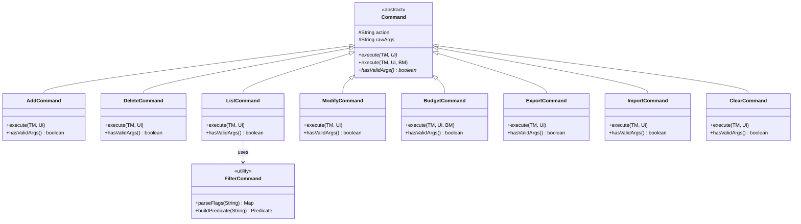

#### Storage Component

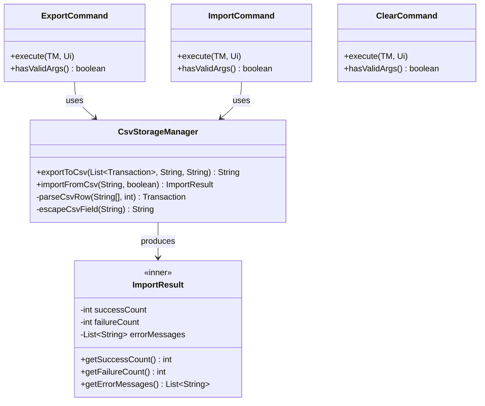

---

## 4. Implementation

### 4.1 Add Transaction

**Classes involved:** `AddCommand`, `TransactionManager`, `BudgetManager`, `Transaction`

**Sequence:**

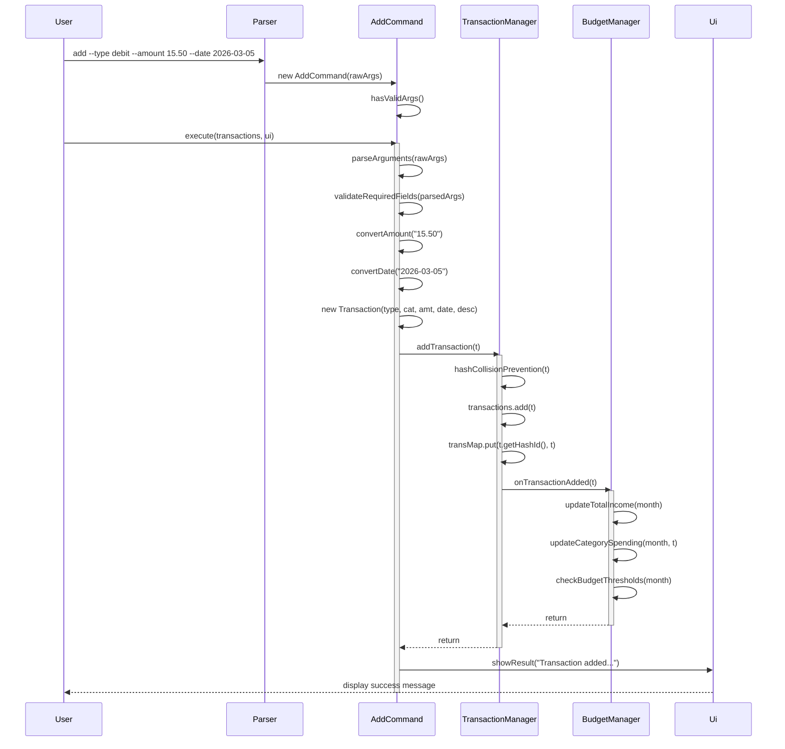

**Design notes:**
- `AddCommand` is self-contained: it parses, validates, converts, and creates the `Transaction` internally. This keeps `TransactionManager` clean.
- Dual-store (ArrayList + HashMap) ensures O(1) lookup while preserving insertion order for display.
- Budget notification is a side-effect of `addTransaction()` — commands do not need to be aware of the budget system.

---

### 4.2 Delete Transaction

**Classes involved:** `DeleteCommand`, `TransactionManager`, `BudgetManager`

**Sequence:**

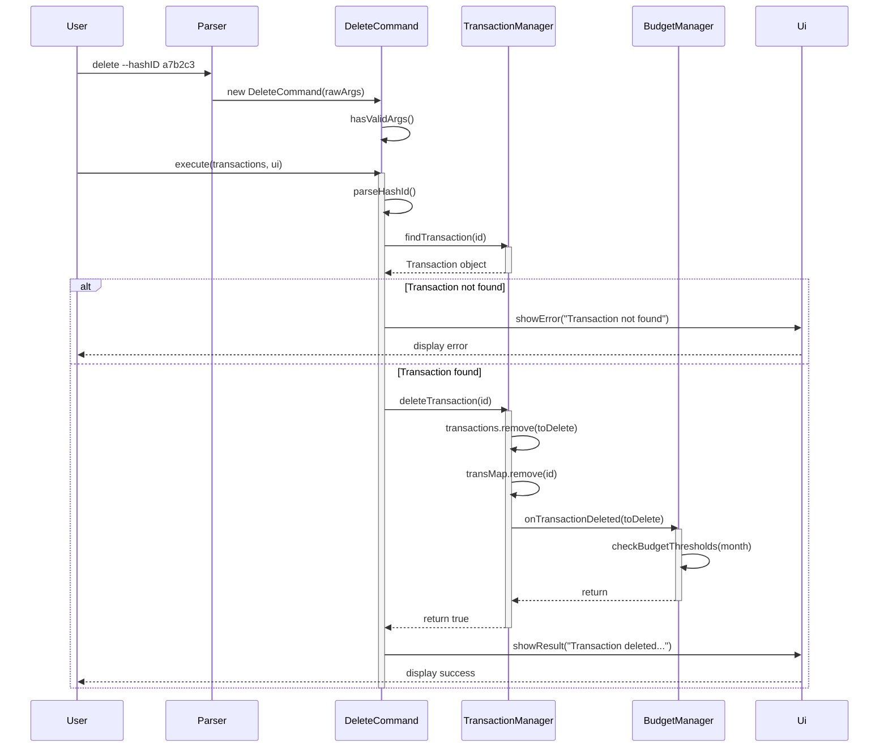

---

### 4.3 Modify Transaction

**Classes involved:** `ModifyCommand`, `TransactionManager`, `BudgetManager`, `Transaction`

**Sequence:**

```
Taller Roshan
```

**Design notes:**
- The updated `Transaction` keeps the same HashID as the original (`setHashId` is called with the original ID before calling `updateTransaction`).
- Both the ArrayList position and the HashMap entry are updated atomically within `updateTransaction`.

---

### 4.4 List and Filter Transactions

**Classes involved:** `ListCommand`, `FilterCommand`, `TransactionSorter`, `TransactionManager`

**Sequence:**

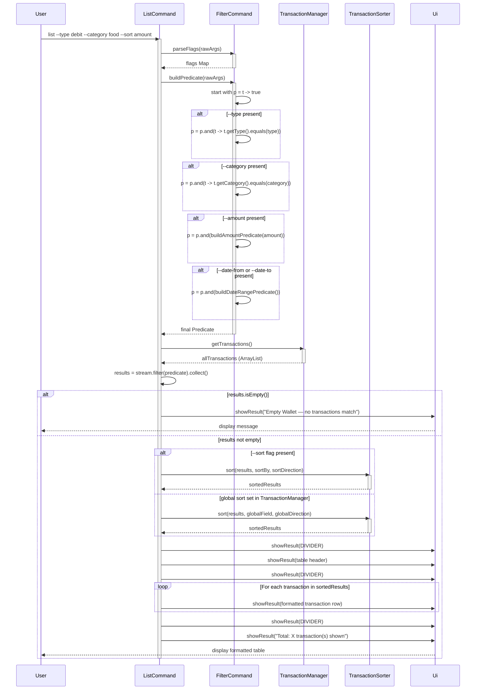

**How `FilterCommand.buildPredicate()` works:**

Predicates are composed using `Predicate.and()` — each active flag adds a new AND condition. The starting predicate is `t -> true` (match all), and each flag narrows it:

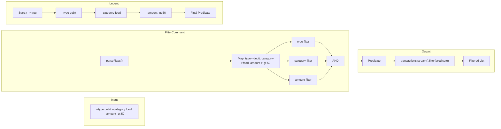

This design means `FilterCommand` can be reused by any command that needs transaction filtering (currently `ListCommand` and `SummarizeCommand`).

**Sort priority:**
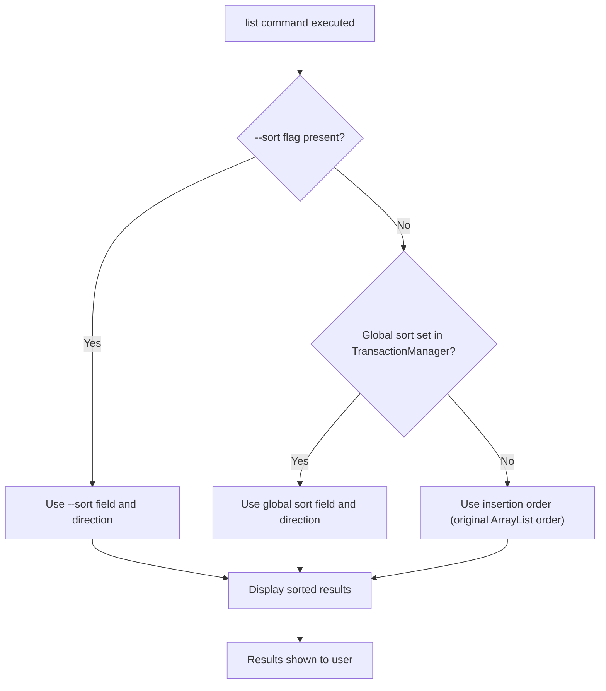
1. `--sort` flag in the `list` command (highest priority, one-time).
2. Global sort set via `sort` command (falls back if no `--sort` flag).
3. Insertion order (default if neither is set).

---

### 4.5 Sort Transactions

**Classes involved:** `SortCommand`, `TransactionManager`, `TransactionSorter`

`SortCommand` does not sort transactions itself — it writes the desired sort field and direction to `TransactionManager` via `setGlobalSort()`. `ListCommand` reads these stored values on each invocation.

```
Le Kuan
```

---

### 4.6 Summarize Transactions

**Classes involved:** `SummarizeCommand`, `FilterCommand`

`SummarizeCommand` reuses `FilterCommand.buildPredicate()` identically to `ListCommand`, then aggregates filtered results:

```
Taller Roshan
```

BigDecimal is used for all summation to avoid floating-point precision errors.

---

### 4.7 Budget Management

**Classes involved:** `BudgetCommand`, `BudgetManager`, `MonthlyBudget`, `BudgetCategory`, `TransactionManager`

#### Setting a Budget

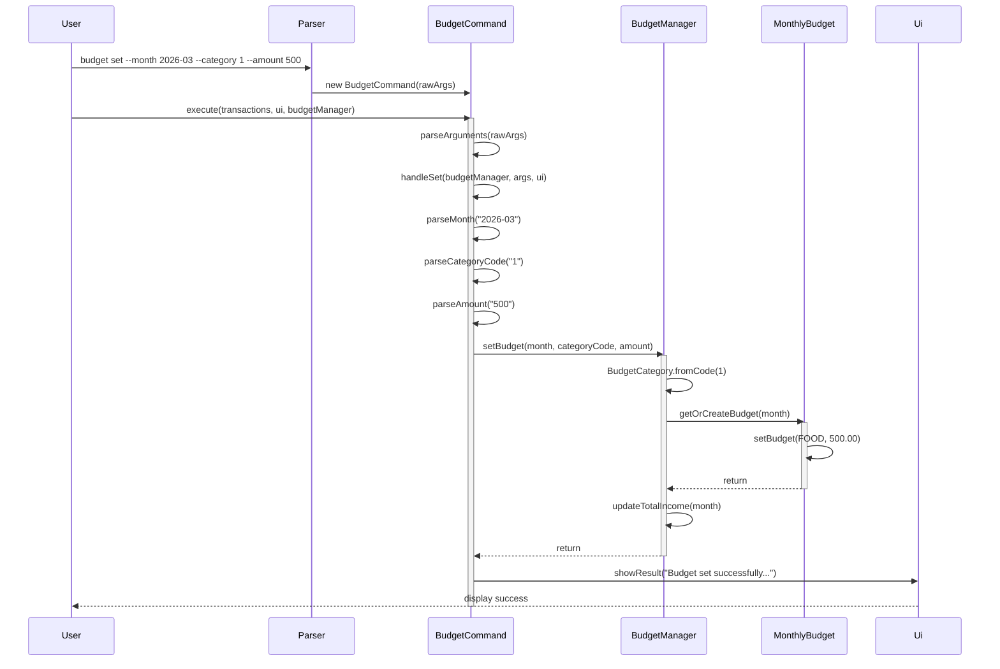

#### Budget Progress Tracking

`BudgetManager` reacts to transaction lifecycle events:

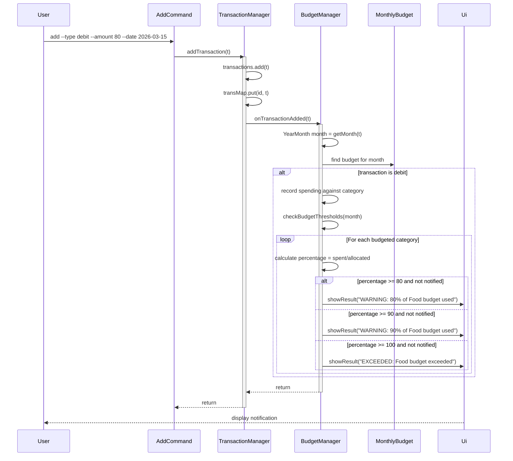

#### Viewing Budget Progress

`BudgetManager.getProgress(month, category)` returns a `BudgetProgress` record containing:
- `allocated` — the budget amount set for the category
- `spent` — sum of all debit transactions in that month matching the category
- `remaining` — allocated - spent
- `percentage` — (spent / allocated) * 100
- `getProgressBar(length)` — renders a Unicode block progress bar

---

### 4.8 Storage Management (CSV Export/Import & Clear)

This feature is implemented across three new command classes and one new storage utility class.

#### 4.8.1 Export (`ExportCommand` + `CsvStorageManager.exportToCsv`)

```
Le Kuan
```

**CSV escaping rules:**
- If a field contains a comma, double-quote, or newline, wrap it in double-quotes.
- Any existing double-quote characters within the field are doubled (`"` becomes `""`).

#### 4.8.2 Import (`ImportCommand` + `CsvStorageManager.importFromCsv`)

```
Le Kuan
```

**Sequence diagram for import (replace mode):**

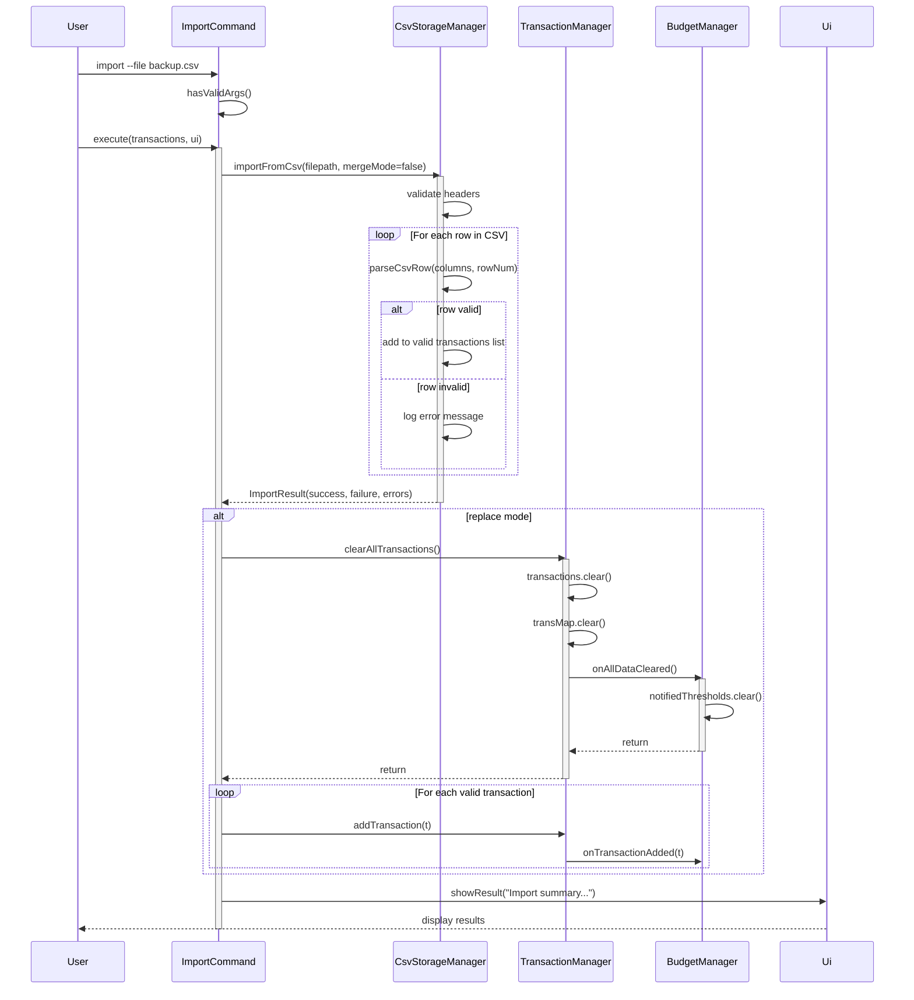

#### 4.8.3 Clear (`ClearCommand`)

```
Le Kuan
```

#### Parser Changes Required

`Parser.java` must be updated to recognise the three new commands:

```java
private static boolean isValidAction(String action) {
    return action.matches("add|delete|modify|list|sort|summarize|help|exit|budget|export|import|clear");
}

private static boolean requiresArguments(String action) {
    return action.matches("add|delete|modify|budget|import");
}

// In parse():
case "export": return new ExportCommand(arguments);
case "import": return new ImportCommand(arguments);
case "clear":  return new ClearCommand(arguments);
```

#### TransactionManager Changes Required

```java
/**
 * Clears all transactions from storage.
 * Used by: ClearCommand, ImportCommand (replace mode)
 */
public void clearAllTransactions() {
    transactions.clear();
    transMap.clear();
    if (budgetManager != null) {
        budgetManager.onAllDataCleared();
    }
}
```

#### BudgetManager Changes Required

```java
/**
 * Handles clearing of all transaction data.
 * Resets notification tracking and recalculates income/spending.
 */
public void onAllDataCleared() {
    notifiedThresholds.clear();
    for (YearMonth month : budgets.keySet()) {
        updateTotalIncome(month);
        checkBudgetThresholds(month);
    }
}
```

#### Ui Changes Required

```java
/**
 * Prompts the user for confirmation before a destructive action.
 * @param prompt     Warning message to display
 * @param expected   The string the user must type to confirm (e.g., "CONFIRM")
 * @return true if the user typed the expected string (case-insensitive)
 */
public boolean askConfirmation(String prompt, String expected) {
    System.out.println(prompt);
    System.out.print("> ");
    String input = userScanner.nextLine();
    return input.trim().equalsIgnoreCase(expected);
}
```

---

## 5. Product Scope

### Target User Profile

NUS students or young adults managing personal finances from the command line who prefer a lightweight tool over GUI apps or spreadsheets. The ideal user is comfortable with typed commands, values speed over visual polish, and wants to avoid subscription-based finance apps.

### Value Proposition

RLAD lets users record, filter, sort, and summarize financial transactions entirely from the terminal — faster than GUI apps for keyboard-driven users. The budget system provides proactive spending awareness, and CSV export/import enables data portability and compatibility with spreadsheet tools.

---

## 6. User Stories

| Version | As a ...      | I want to ...                                              | So that I can ...                                 |
|---------|---------------|------------------------------------------------------------|---------------------------------------------------|
| v1.0    | new user      | see usage instructions                                     | refer to them when I forget how to use the app    |
| v1.0    | user          | add income and expense transactions                        | track my cash flow                                |
| v1.0    | user          | delete a transaction by ID                                 | correct mistakes                                  |
| v1.0    | user          | list all my transactions                                   | review my spending history                        |
| v1.0    | user          | filter transactions by type, category, or date             | find specific records quickly                     |
| v1.0    | user          | sort transactions by amount or date                        | identify largest expenses or recent activity      |
| v1.0    | user          | see a financial summary                                    | understand my net balance and category spending   |
| v2.0    | user          | set a monthly budget per category                          | plan my spending in advance                       |
| v2.0    | user          | view budget progress with a visual progress bar            | see at a glance where I am overspending           |
| v2.0    | user          | edit or delete a budget                                    | adjust my plans when circumstances change         |
| v2.0    | user          | modify an existing transaction                             | correct wrong amounts or categories               |
| v2.0    | user          | export all my transactions to CSV                          | back up my data or analyse it in Excel            |
| v2.0    | user          | import transactions from a CSV file                        | restore a backup or migrate data                  |
| v2.0    | user          | merge imported data with existing transactions             | add bulk data without losing current records      |
| v2.0    | user          | clear all transaction data with confirmation               | start fresh without accidental data loss          |

---

## 7. Non-Functional Requirements

- **Performance:** All operations on up to 1,000 transactions must complete in under 1 second on a standard laptop (macOS/Windows/Linux, JDK 17).
- **Reliability:** HashID collision prevention must guarantee uniqueness across the session.
- **Portability:** The application must run on any OS with JDK 17+. No OS-specific APIs are used.
- **Data integrity:** CSV import must gracefully skip malformed rows without crashing. Failed rows are reported but do not abort the import.
- **Maintainability:** New commands must only require adding a new `Command` subclass and one `case` in `Parser`. The existing architecture must not require modification.
- **Usability:** All error messages must state the invalid input and what was expected. No stack traces are exposed to the user.

---

## 8. Glossary

| Term              | Definition                                                                                          |
|-------------------|-----------------------------------------------------------------------------------------------------|
| Transaction       | A financial record with type, amount, date, optional category and description.                      |
| HashID            | A 6-character unique identifier auto-generated for each transaction (e.g., `a7b2c3`).              |
| Credit            | A transaction representing money in (income).                                                       |
| Debit             | A transaction representing money out (expense).                                                     |
| Predicate         | A Java functional interface that returns `true`/`false` for a given Transaction. Used for filtering.|
| BudgetCategory    | One of 12 fixed spending categories defined in the `BudgetCategory` enum.                           |
| Disposable Income | Total recorded credits minus total allocated budget amounts for a given month.                      |
| Merge mode        | An import mode that adds imported transactions to existing data rather than replacing it.            |
| Global sort       | A persistent sort order stored in `TransactionManager` and applied to all `list` commands.          |
| ImportResult      | A value object returned by `CsvStorageManager` containing success count, failure count, and errors. |

---

## 9. Instructions for Manual Testing

> These tests verify core functionality. Run them in sequence on a fresh launch.

### 9.1 Add Transactions

1. Add a credit:
   ```
   add --type credit --amount 3000.00 --date 2026-03-01 --category salary --description "March salary"
   ```
   Expected: success message with a HashID.

2. Add a debit:
   ```
   add --type debit --amount 15.50 --date 2026-03-05 --category food --description "Chicken rice"
   ```
   Expected: success message with a different HashID.

3. Add without optional fields:
   ```
   add --type debit --amount 5.00 --date 2026-03-06
   ```
   Expected: success. Category and Description show as `(none)`.

4. Add with invalid type:
   ```
   add --type cash --amount 10.00 --date 2026-03-07
   ```
   Expected: error message — Invalid `--type`.

### 9.2 List and Filter

5. List all:
   ```
   list
   ```
   Expected: all 3 transactions shown.

6. Filter by type:
   ```
   list --type credit
   ```
   Expected: only the salary transaction.

7. Filter by amount:
   ```
   list --amount -gt 10.00
   ```
   Expected: salary ($3000) and chicken rice ($15.50) shown.

8. Filter by date range:
   ```
   list --date-from 2026-03-05 --date-to 2026-03-06
   ```
   Expected: chicken rice and the $5.00 debit shown.

9. Sort by amount descending:
   ```
   list --sort amount desc
   ```
   Expected: salary first, then chicken rice, then $5.00.

### 9.3 Sort (Global)

10. Set global sort:
    ```
    sort amount asc
    ```
    Expected: confirmation message.

11. List (uses global sort):
    ```
    list
    ```
    Expected: transactions sorted by amount ascending.

12. Reset:
    ```
    sort reset
    ```

### 9.4 Summarize

13. Summarize all:
    ```
    summarize
    ```
    Expected: Total Credit $3000, Total Debit $20.50, Net $2979.50.

### 9.5 Modify

14. Note the HashID of the chicken rice transaction from step 2. Modify its amount:
    ```
    modify --hashID <ID> --amount 20.00 --description "Fancy chicken rice"
    ```
    Expected: success. Verify with `list`.

### 9.6 Delete

15. Note the HashID of the $5.00 transaction. Delete it:
    ```
    delete --hashID <ID>
    ```
    Expected: success. Verify with `list` — only 2 transactions remain.

16. Attempt to delete with an invalid ID:
    ```
    delete --hashID zzzzzz
    ```
    Expected: error — Transaction not found.

### 9.7 Budget

17. Set a food budget for March:
    ```
    budget set --month 2026-03 --category 1 --amount 200.00
    ```
    Expected: success.

18. View the budget:
    ```
    budget view --month 2026-03
    ```
    Expected: Food row with progress bar. Spent amount reflects debit transactions in March.

19. Edit the budget:
    ```
    budget edit --month 2026-03 --category 1 --amount 250.00
    ```
    Expected: success.

20. Delete the budget:
    ```
    budget delete --month 2026-03 --category 1
    ```
    Expected: success.

### 9.8 Export

21. Export all transactions:
    ```
    export
    ```
    Expected: CSV file created with default filename. Open the file and verify rows match transactions.

22. Export with custom filename:
    ```
    export --file test_backup.csv
    ```
    Expected: file `test_backup.csv` created.

### 9.9 Import

23. Import with replace mode:
    ```
    import --file test_backup.csv
    ```
    Expected: existing transactions replaced with imported ones. Counts match.

24. Add a new transaction, then merge:
    ```
    add --type debit --amount 50.00 --date 2026-03-10 --category transport
    import --file test_backup.csv --merge
    ```
    Expected: new transaction preserved, CSV transactions added on top.

25. Import a non-existent file:
    ```
    import --file nonexistent.csv
    ```
    Expected: error — file not found.

### 9.10 Clear

26. Clear with confirmation:
    ```
    clear
    ```
    At the prompt, type `CONFIRM`.
    Expected: all transactions deleted. `list` shows empty.

27. Cancel clear:
    ```
    clear
    ```
    At the prompt, type anything other than `CONFIRM`.
    Expected: operation cancelled, data unchanged.

28. Force clear:
    ```
    clear --force
    ```
    Expected: all transactions deleted immediately, no prompt.

### 9.11 Exit

29. Exit:
    ```
    exit
    ```
    Expected: farewell message and application terminates.